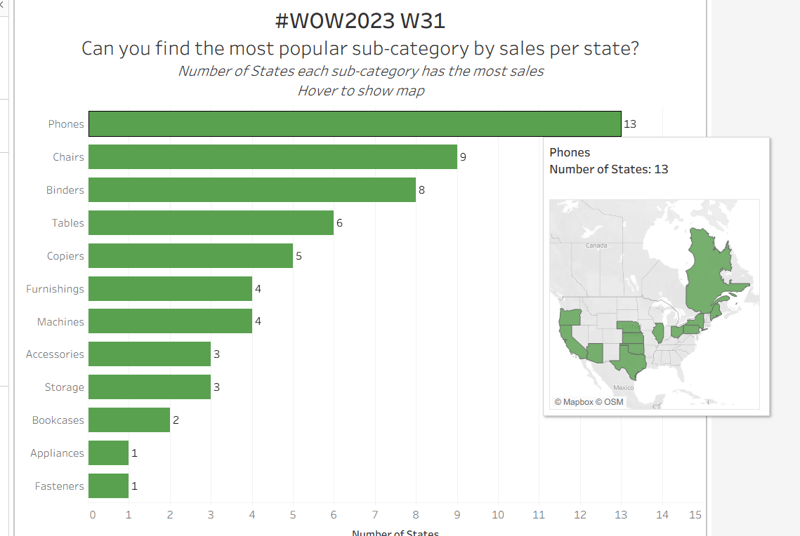

# Most Popular Sub-Category by Sales per State  
*(#WOW2023 Week 31 Challenge)*

**Author:** Dhanalakshmi Kannur Munirathnam   
**Tool:** Tableau  
**Dataset:** Superstore – Sales by State (#WOW2023 W31 dataset)

---

## 📊 Project Overview
This Tableau dashboard identifies **which product sub-category achieved the highest total sales** in each U.S. state.  
It provides an interactive visualization that allows users to explore dominant sub-categories and their regional distribution.

---

## 🎯 Key Insights
- **Phones** are the top-selling sub-category in **13 U.S. states**, leading overall.  
- **Chairs** and **Binders** follow closely, dominating **9** and **8** states respectively.  
- The **geographic distribution map** shows these trends are concentrated in industrial and tech-heavy regions.  
- The dashboard provides quick, visual understanding of how preferences vary across states.  

---

## 🗺️ Dashboard Components
1. **Horizontal Bar Chart:** Displays number of states where each sub-category ranks #1 in sales.  
2. **Interactive Map:** Shows states where a selected sub-category is most popular.  
3. **Tooltip Interactivity:** Hovering highlights the states contributing to that category.  
4. **Dynamic Headline:** Reinforces the analytical question visually.

---

## 🧠 Tableau Techniques Used
- Calculated fields to identify top-selling sub-category per state.  
- Parameter-driven interactivity for hover-to-map linking.  
- Dual visualization layout (bar + map).  
- Consistent green color palette to indicate category dominance.  
- Dashboard formatting and responsive alignment for desktop view.

---

## 🌐 View Interactive Dashboard
[View on Tableau Public →](https://public.tableau.com/app/profile/dhanalakshmi.kannur.munirathnam/viz/Dhanalakshmi-Kannur-Munirathnam-BIS582Assignment6/Dashboard1](https://public.tableau.com/views/tableau-popular-subcategory-sales/FinalDashboard?:language=en-US&publish=yes&:sid=&:redirect=auth&:display_count=n&:origin=viz_share_link)

---

## 📷 Preview

---

## 📂 Files
| File | Description |
|------|--------------|
| `tableau-popular-subcategory-sales.twbx` | Tableau workbook |
| `dashboard.png` | Dashboard screenshot |

---

## 💡 Reflection
This challenge strengthened my understanding of **spatial and categorical analysis in Tableau**.  
It shows how combining mapping and bar charts can uncover **regional business insights**—a technique useful for market segmentation, product targeting, and strategy planning.
